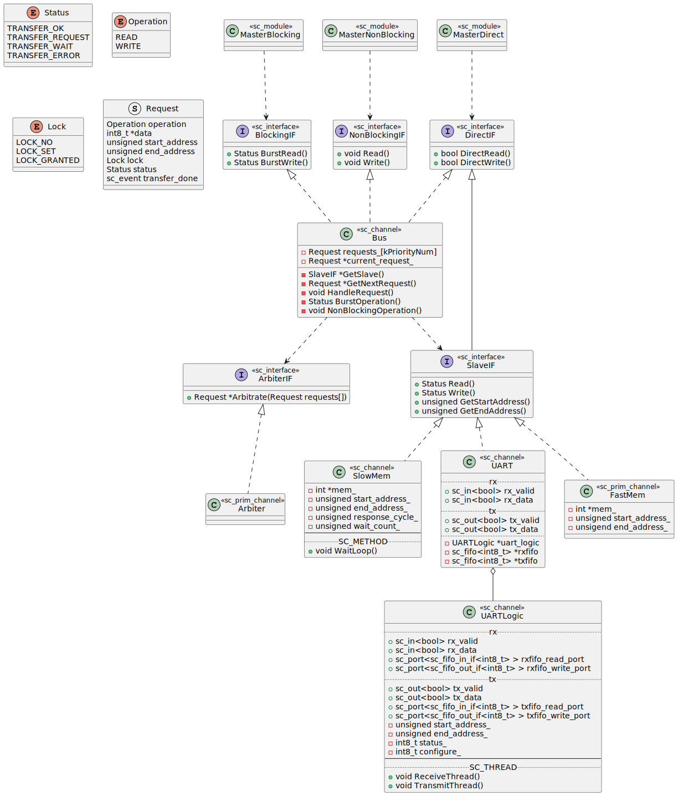

# Simple SoC TLM

## Diagram


## Dependencies

+ [Virtual Components Modeling Library](https://github.com/machineware-gmbh/vcml)

## Build

```sh
# Setup environable variables
export SYSTEMC_HOME=/usr/local/systemc-2.3.3
export VCML_HOME=/usr/local/vcml
export LD_LIBRARY_PATH=$LD_LIBRARY_PATH:$SYSTEMC_HOME/lib-linux64:$VCML_HOME/lib
# budild and run
make
./build/out
```

## Debug

```sh
make clean; make debug=1
```

## Documents

```sh
make doc
# open docs/doxygen/index.html
```

The documents are generated in `/docs/doxygen` directory.

## UML



## TODO

* [ ] update bus::MainThread sensitive list, avoiding sc_start(time) in sc_main()
* [ ] shift to use TLM2.0
